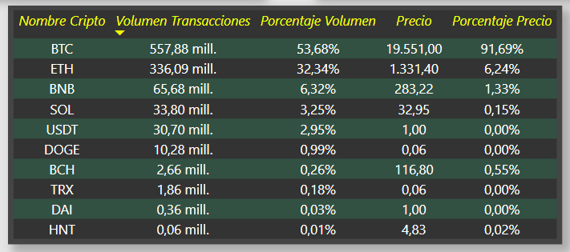

# Dashboard de Criptomonedas

## Introducción
Este proyecto consta de un dashboard interactivo de 10 criptomonedas las cuales son:

* Bitcoin Cash (BCH)
* Binance Coin (BNB)
* Bitcoin (BTC)
* Dogecoin (DOGE)
* Ethereum (ETH)
* Helium (HNT)
* Solana (SOL)
* Tron (TRX)
* DAI
* Tether (USDT)

Este dashboard consume datos de una [API](https://docs.ftx.com/#overview) de FTX la cual trae datos de las criptomonedas y precios de los ultimos 2 meses.

## Funciones:

* ## Actualizacion de datos:

Para actualizar los datos a los mas recientes, hay que ir a la barra de inicio y dar clic en el boton que dice *Actualizar* como se observa en la imagen.

* ## Panel de la Criptomoneda

### Fechas: 

Es un menu desplegable es cual se puede seleccionar la fecha en que se desea conocer el precio o movimiento de la criptomoneda, ya sea por dia o por mes (Toca tener en cuenta que el dashboard solo recibe datos de los ultimos dos meses).

### Precio Historico por Hora:

Esta grafica, la cual podemos deslizarnos por ella, muestra el precio en dolares historico de cierre de la criptomoneda por horas.

### Precio Historico por Día:

Esta grafica, la cual podemos deslizarnos por ella, muestra el precio en dolares historico de cierre de la criptomoneda por días y tambien muestra la [Media Móvil. ](https://economipedia.com/definiciones/media-movil.html)

Si se coloca el cursor sobre un punto en el plano, se podra observar el precio en dolares en el que cerro ese dia y el precio de la *Media Movil*

### Precio mayor:

Esta tabla muestra, en orden descendente, una lista de precios, representada en dolares, el cual inicia con el mayor precio registrado con su respectiva fecha y hora, si aplicamos algun filtro en fecha, esta tabla se acomodara al filtro.

### Varianza:

Esta tabla muestra una lista con la [Varianza](https://economipedia.com/definiciones/varianza.html#:~:text=La%20varianza%20es%20una%20medida,la%20desviaci%C3%B3n%20t%C3%ADpica%20al%20cuadrado) de cada dia, representada en dolares.

### Barra de Paginas:

En la parte inferior del dashboard se encuentra las paginas a cada una de las presentaciones de cada criptomoneda al igual que el panel general.

* ## Panel General

### Volumen de Transacciones:

En esta grafica se puede observar el volumen del total de movimientos que realizo cada criptomoneda durante las ultimas 24 hora, representada en dolares.

### Precio de la Criptomoneda:

En esta grafica se puede observar el precio actual en dolares de cada criptomoneda.

### Tabla de contenido de cada criptomoneda

En esta tabla esta reflejado el contenido de ambas graficas, incluyendo el porcentaje de cara criptomoneda que ocupa con respecto a las otras criptomonedas.